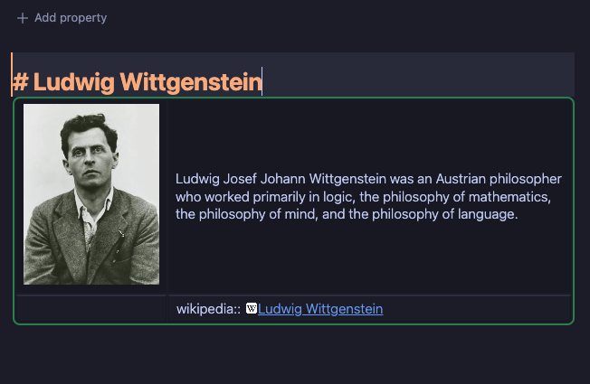
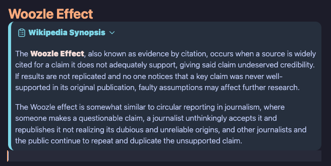

# Obsidian Wikipedia Data Plugin
This is a plugin for [Obsidian](https://obsidian.md) that queries Wikipedia APIs to add data like an image url, article description, text summary, and article url to your Obsidian notes. The plugin provides commands that query Wikipedia based on your active note's title and inserts text based on customizable templates and template variables.
## Features
- Easy way to add useful Wikipedia data to your notes, like article summaries, images, and URLs.
- Customizable with many template variables and the option to have multiple distinct templates for different situations.
- Works on both mobile and desktop.
- Sensible defaults and templates ready to use.
## Examples
  
Note named Ludwig Wittgenstein and default template #1 with `summary` template variable  
  
Note named Woozle Effect and default template #2 with `introText` template variable
## How to Use
1. Put your cursor where you want the template to be inserted in your note.
2. Run the "Apply Template #1 for Active Note Title" command to insert the template to your note.
- The plugin gets data from Wikipedia based on the active note's title.
- You can customize the template in the plugin's settings to change the format and variables you want from Wikipedia.
## Commands
- Adds command "Apply Template #1 for Active Note Title" which queries Wikipedia and inserts data based on the templates defined in settings.
- Adds 2 duplicates of above command to allow for customizing multiple templates instead of being limited to one template for all situations.
## Settings
***Wikipedia language prefix:*** E.g. `en` for English.   
***Bold search term?*** Whether to bold search term in template text.  
### Templates
***Wikipedia template #1, 2 & 3:*** Customize with template variables below.  
***Thumbnail template:*** Customize how images will be inserted.  
***Use paragraph template?*** Whether to use 'Paragraph template' below.  
***Paragraph template:*** Customize how each paragraph will be displayed in the 'introText' template variable. E.g, if you want double line breaks between each paragraph or if you want them as block quotes, etc.  
#### Template Variables
`{{title}}` - Wikipedia page title. E.g, 'Ludwig Wittgenstein'.  
`{{url}}` - URL of the Wikipedia page.  
`{{description}}` - Short, simple description of the article. Usually just a fragment. E.g, 'Austrian philosopher and logician (1889–1951)'.  
`{{summary}}` - Medium length explanation of the article in 1 or a few sentences. E.g, 'Ludwig Josef Johann Wittgenstein was an Austrian philosopher who worked primarily in   logic, the philosophy of mathematics, the philosophy of mind, and the philosophy of language.'.  
`{{introText}}` - Longer explanation, sometimes multiple paragraphs - the first intro section of a Wikipedia article.  
`{{id}}` - Page ID of the Wikipedia page. E.g, '17741'.  
`{{key}}` - Key of the Wikipedia page. E.g, 'Ludwig_Wittgenstein'.  
`{{thumbnailTemplate}}` - Inserts the Wikipedia 'Thumbnail template' defined below.  
`{{thumbnailUrl}}` - Inserts the url of the article's thumbnail image (if it has one). (Normally one would only use this variable inside the 'Thumbnail template' below, but   you can use it directly in the 'Wikipedia templates' as well.)  
## Development Rationale
This plugin was inspired by and based on the very useful [obsidian-wikipedia](https://github.com/jmilldotdev/obsidian-wikipedia) plugin. I also got some ideas from the [obsidian-wikipedia-search](https://github.com/StrangeGirlMurph/obsidian-wikipedia-search) plugin. However, I wanted some additional customizations. For example, I wanted more data and options to use in a custom template (such as an image thumbnail), multiple templates for different situations, and a better short to medium length summary of the article. I also determined that using [WikiMedia's REST API](https://en.wikipedia.org/api/rest_v1/) has some advantages over the [MediaWiki API](https://www.mediawiki.org/wiki/API:Main_page) that both of those plugins use. Most notably, WikiMedia's API can return an article "summary" that is consistently formatted and never more than a paragraph. It's a good middle ground between the shorter "description" and often much longer introductory text "extracts" which can sometimes take up over a page. Further, the obsidian-wikipedia plugin suffers from the occassional omission of line breaks due to MediaWiki's API [bug](https://phabricator.wikimedia.org/T201946), making those summaries sometimes difficult to read and integrate into your note's consistently. I also wanted a clear practical use case to help me learn how to make my first Obsidian plugin.
In the end, I ended up utilizing 3 API's to get all the customizations I wanted:  
- [WikiMedia's REST API](https://en.wikipedia.org/api/rest_v1/)
- [MediaWiki's REST API](https://www.mediawiki.org/wiki/API:REST_API)
- [MediaWiki's Action API](https://www.mediawiki.org/wiki/API:Main_page)
## Installation
### Obsidian BRAT Plugin for Beta Testing
[Obsidian BRAT Plugin](https://tfthacker.com/BRAT)
1. Install the BRAT plugin: `obsidian://show-plugin?id=obsidian42-brat` and enable it.
2. Copy this repo's URL: `https://github.com/evanharmon1/obsidian-wikipedia-data`.
3. Run the Obsidian command, 'Add a beta plugin for testing', and copy this repo's url to the prompt.
- That should add the latest beta version of this plugin to your list of installed community plugins as normal.
- You can enable BRAT settings like auto updates and notificaitons so you can easily get the latest beta version of this plugin.
### GitHub
1. Download directly from [evanharmon1/obsidian-wikipedia-data](https://github.com/evanharmon1/obsidian-wikipedia-data).
#### Option 1: NPM Script Method
1. Set an environment variable named `obsidianVault` to your vault's path.
    - E.g, on a Mac it would resemble: `/Users/evan/myObsidianVaultFolder`.
2. run `npm run installPlugin` from the repo's directory, which should build the plugin and copy all the needed files to your Obsidian vault.
#### Option 2: Manual Method
1. From the repo, run `npm run build` to generate `main.js` and `manifest.json` files.
2. Create a directory in your vault's `.obsidian/plugins` folder called `obsidian-wikipedia-data`.
3. Copy the generated `main.js` and `manifest.json` files from the repo to the newly created `obsidian-wikipedia-data` folder in your vault.
4. Enable the plugin in Obsidian settings.
## Bug Reports, Feature Requests, & Pull Requests
All are welcome and I'll do what I can to respond.
## Disclaimer
- Use at your own risk. Not heavily tested to ensure no data loss, etc. Make sure you have adequate backups.
## Potential Future Features
- [ ] Handle non-exact article titles better. As it is, your Obsidian note has to have a title that the API can resolve to a specific Wikipedia article.
- [ ] Add option to query based on selected text instead of note title.
- [ ] Add a UI modal to enter a search term and select an article via UI.
- [ ] Add a UI modal that allows the user to pick a specific article when a disambiguation page is returned.
- [ ] Add Ribbon buttons.
- [ ] Add icons for ribbon buttons and mobile commands.